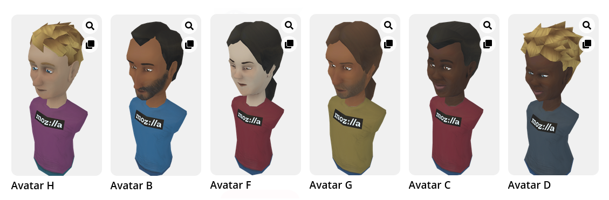

# Hubs Avatar Texture Tool - Alpha Release

This tool is designed to easily allow you to compose new textures to re-skin Hubs humanoid avatars. With this tool, you can upload images to display on the front and back of the avatar's t-shirt, customize your avatar's appearance, and save your textures to your computer. 

# Usage 
This tool does not generate a .glb file to use with the avatars. Instead, you will need to create a new avatar by remixing one of the existing avatar meshes published on Hubs to your own list of saved avatars and uploading your saved texture. 
